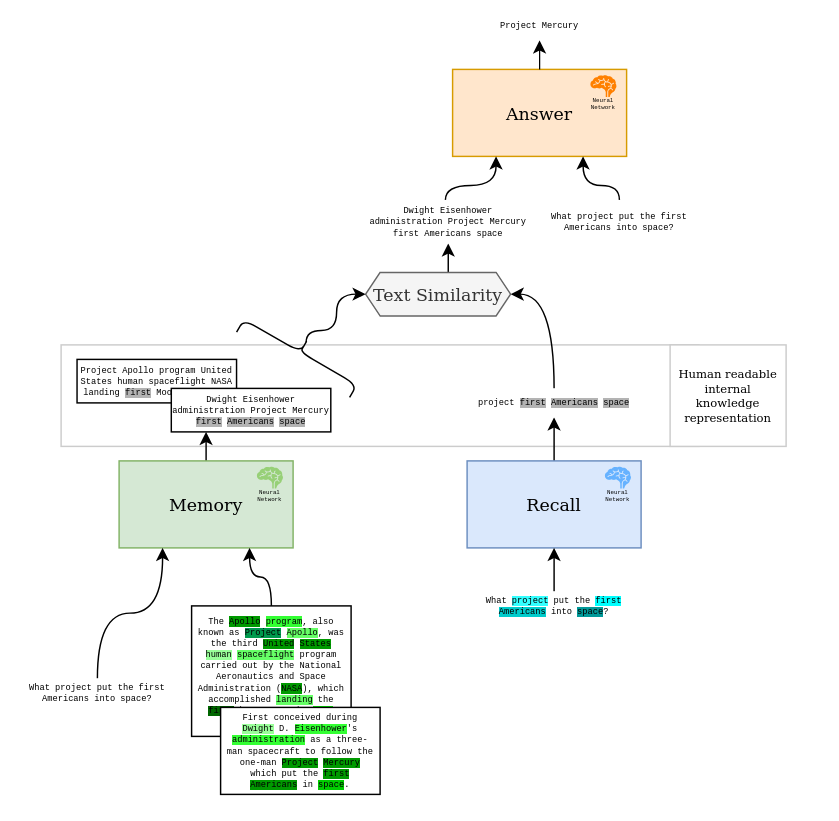
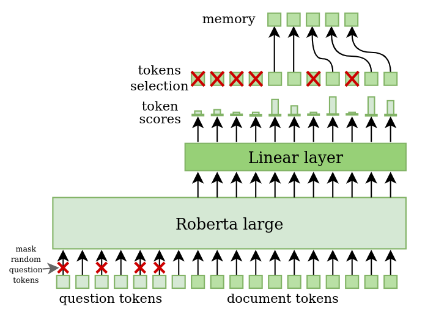
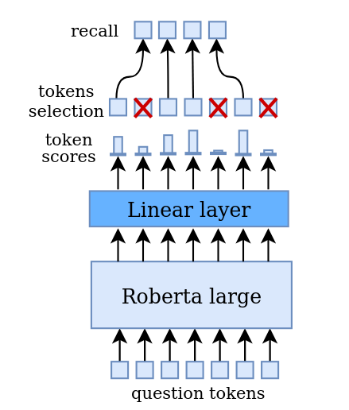
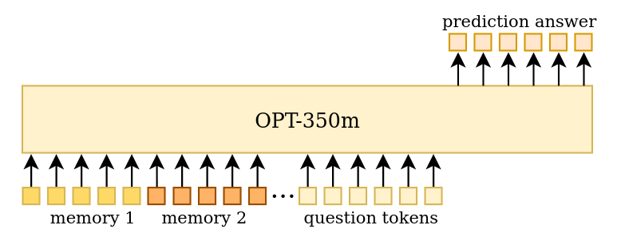
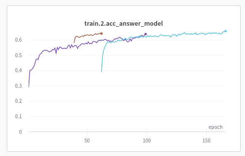
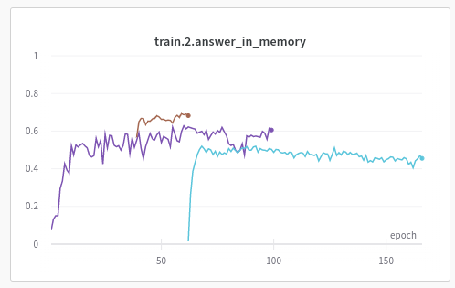

# RL_Nlp

## **Project description**
This projects presents Question-Answering Deep learning agent with seperate networks for memory generation, recalling and answering. The underlaying networks communicated using text tokens which allows us to explore the behaviour in human readable format.

Network overview: \

### Memory
Transformer Encoder network used to select words from read documents related to specific question. Based on input question the model iterates through whole documents and generates fixed tokens memories. \
The expectation is that generated memories extract important information based on quesation context. The memories can be later used as knowledge representation. \
Reinforcement learning (RL) PPO (Proximal Policy Optimization) algorithm is used to train this network. The rewards is based on the accuracy of the Answer network.
### Recall
Similar to Memory - Recall network uses transformer Encoder architecture to extract question tokens, which then are used to select most relevant memories. The same Reinforcement learning objective is used for the training.\
Recall networks can be called muliple time to generate more memories used for example in multisteps reasoning (HotpotQA dataset).
### Text Similarity
Non-trainable algorithm used to rank memories based on recall tokens.\
Top sentences are used as an input to Answer network.
### Answer
GPT style network used to generate answer. Recalled memories are concatenated to question and used as an input to the network. \
Cross Entropy loss is used for training.

## **Implementation**
### Small scale architecture
The underlaying Transformer networks were based on publically available finetune models ([huggingface](https://huggingface.co/)):
* Memory \
[Roberta-large](https://huggingface.co/roberta-large) with top linear layer. \
Question and Documents tokens are concatenated and passed as input to Roberta-large model. Question tokens are randomly masked - this can be used to generate new memories without explicite question. \
Top scored documents tokens are used to create the memory. 

<!--  -->

* Recall \
Independent agent based on similar architecture like Memory network. 

<!--  -->

* Answer \
Finetunned Meta text generative model [OPT-350m](https://huggingface.co/facebook/opt-350m).

<!--  -->

### Multiple RL agents
Reinforcement learning algorithms are not stable on large action space, so we decided to run multiple independent agents (with different learning rates) on the same step. The best performing agent is used to generate next step agents this can be understood as very simple evolutionary algorithm.

## **Current results**

We run small scale training using single RTX3090 GPU:

  

|      | <a style="color:purple">No Recall, 12t Memory, Squad</a> | <a style="color:#8B4513">No Recall, 24t Memory, Squad</a> | <a style="color:#87CEEB">16t Recall, 24t Memory, Squad</a> |
| ----------- | ----------- | ----------- | ----------- | 
| Dataset      | [Squad](https://rajpurkar.github.io/SQuAD-explorer/)       | Squad | Squad | 
| Memory   | 12 tokens        | 24 tokens | 24 tokens | 
| Document length   | 512 tokens        | 512 tokens | 512 tokens | 
| Recall   | No        | No | 16 tokens | 
| batch size   | 48       | 48 | 48 | 
| Number of agents   | 3        | 3 | 3 | 

&nbsp;

Metrics:
* acc_answer_model: Accuracy of the answer model prediction.
* answer_in_memory: Ratio of the answer tokens in the memories.
